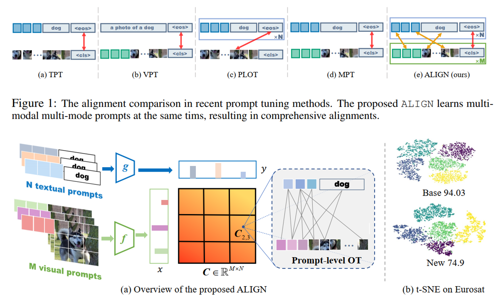

# Tuning Multi-mode Token-level Prompt Alignment across Modalities [NeurIPS 2023]

This is the official implementation of our paper [Tuning Multi-mode Token-level Prompt Alignment across Modalities](https://arxiv.org/abs/2309.13847) in NeurIPS 2023.



The proposed ALIGN algorithm aims to learn multiple prompts in both textual and visual domains. Given the M visual prompts and N textual prompts, ALIGN first views the label/image as discrete distributions over the 
the M and N supporting, and each distribution itself can further be modeled as a discrete distribution over its model-specific token-level space. ALIGN applies the Prompt-level OT and Token-level OT to align those two
domains.

## TODO
Due to some ddls, we will add more details about the training scripts and results soon.

## Getting Started
### Install
- Clone this repo:
```bash
git clone https://github.com/wds2014/ALIGN.git
cd ALIGN
```
-  Please follow the [INSTALL.md](https://github.com/muzairkhattak/multimodal-prompt-learning/tree/main/docs/INSTALL.md) to build the python environment. 

### Dataset
- Datasets in our paper

The datasets we used is as the same as previous works (CoOp and MAPLE). Please follow the [DATASETS.md](https://github.com/muzairkhattak/multimodal-prompt-learning/tree/main/docs/DATASETS.md) to prepare all datasets.

### Training
- Easy to train:
```bash
cd scripts/mmp
bash base_to_new_train.sh
```
Change the DATASET and SEED in the .sh file to train our model in different datasets and seeds.

## Citation
If you find this repo useful to your project, please consider to cite it with following bib:

```bash
@article{wang2023tuning,
  title={Tuning Multi-mode Token-level Prompt Alignment across Modalities},
  author={Wang, Dongsheng and Li, Miaoge and Liu, Xinyang and Xu, MingSheng and Chen, Bo and Zhang, Hanwang},
  journal={arXiv preprint arXiv:2309.13847},
  year={2023}
}
```

## Acknowledgements
Our code is modified based on [CoOp](https://github.com/KaiyangZhou/CoOp) and [MAPLE](https://github.com/muzairkhattak/multimodal-prompt-learning/tree/main) repository. 
We thank the authors for releasing their code. 